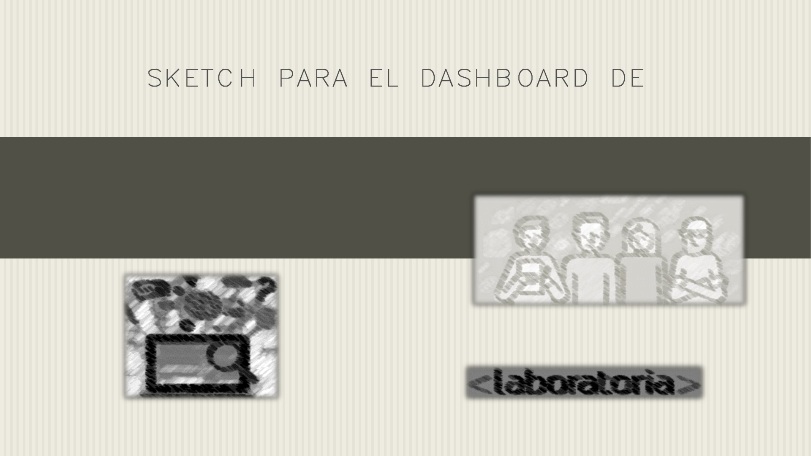
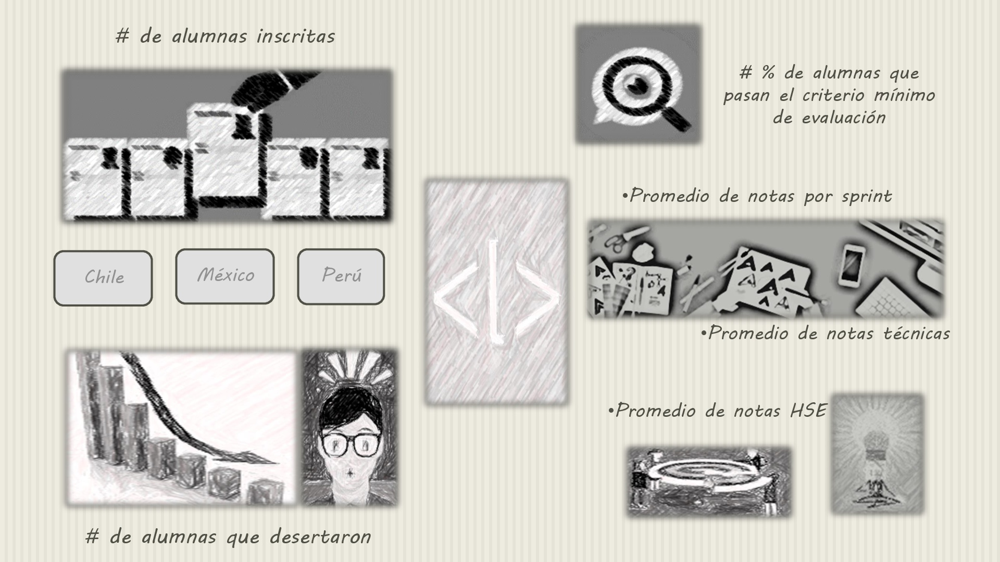

## Intro a User Experience Design.

1. Explica que partes conforman el UX y  que partes el UI de Laboratoria.

 ### UX
 
Dirigido a chicas y empresas que tengan hambre de crecimiento y quieran obtener mejores oportunidades de desarrollo, El mensaje que da Laboratoria es la resolución de problemas tecnológicos, entendiendo tanto  las necesidades de las chicas como la de las empresas que lleguen a interesrse en el talento Tech femenino; al ver  la página web, se refleja la eficiencia y satisfacción  del programa que imparte Laboratoria a través de los aliados institucionales que la respaldan, los reconocimientos internacionales, la presencia en medios, el impacto en números de alumnas graduadas, de las empresas empleadoras, y lo más importante la relación de la colocación laboral con la satisfacción de las empresas objetivo primordial de Laboratoria.

## Objetivo de la pagina web visto en la resolucion del reto.

modelo de negocio 1. Conseguir postulantes
modelo de negocio 2. Empresas que contraten egresadas
modelo de negocio 3. Contratar capacitaciones para tu empresa 4. Bolsa de trabajo.
-usabilidad facilidad con la que el usuario puede navegar en el sitio.
-es desplegables
-utilidad

## UI

 Página web divida en 15 secciones, donde se observa el logotipo y los colores representativos de la empresa amarillo/blanco, una Navegación general y una subnavegación para estudiantes y empresas, menús, desplegables, botones, enlaces / ligas / links  para videos, blogs y para postular/postear una oferta, ventanas despegable de encuesta para recomendar el sitio y reclutar talento y para un chat de dudas para las estudiantes, esquinas redondeadas, sombreado y subrayado de texto ,checkboxes para solicitar información del desempeño de las estudiantes en el bootcamp, campos de búsqueda entre las tres sedes, Perú, México y Chile, entradas de texto para el formulario de postulación y publicación de una oferta, estados de hover de cursor flecha a cursor manita, estados de selección, animaciones de desplazamiento vertical, clics, ventanas emergentes e iconografía para redes sociales e email.

### Cosas que me faltaron notar de UI y que vimos en la resolucion del reto.

- La disposicion de los elementos estan centrados
- Reglas de contraste de los elementos
- Fondo de pagina es blanco, a menos que haya fotografia.
- Mostrar datos duros de forma que sea muy llamativo al usuario, usando otro color de fondo que contraste.
- footer: el logo de laboratoria y la visión. Enlaces de contacto con una redireccion, y al pasar el cursor se va subrayar.

2. Identificando los elementos de navegacion en GitHub

- navegacion global
- nabegacion local
- navegacion facetada

3. Sketch para la herramienta del dashboard de Laboratoria

### Imagen de Skectch

